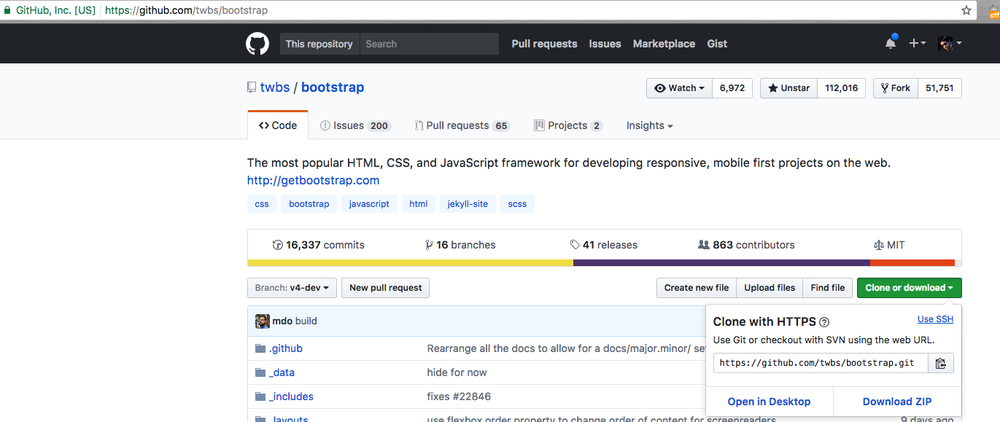

# Git clone

Often, we'll want a local copy of a public repository on our local devices. This is called a clone in Git terminology.

To create a local clone, find the GitHub repository URL and copy it - either from the address bar or with the copy to clipboard button (see red boxes below).



In the terminal, navigate to the directory to store the cloned repository and run git clone with the chosen repo's URL:
```
$ git clone https://github.com/vendor/package_name
Cloning into 'package_name'...
remote: Counting objects: 14, done.
remote: Total 14 (delta 0), reused 0 (delta 0), pack-reused 14
Unpacking objects: 100% (14/14), done.
Checking connectivity... done.
```
The clone command creates a clone of the remote repository in the current directory, including the initialized .git repository so you can immediately begin working and making commits.
