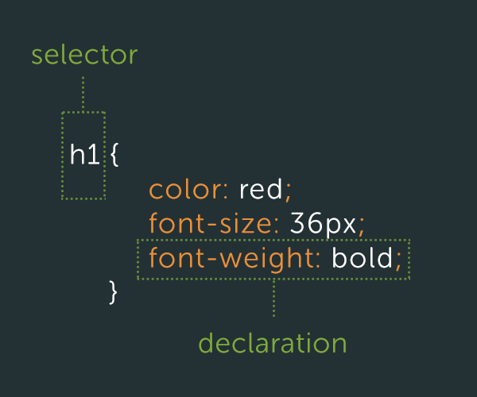

# Another look at CSS Selectors

Selectors allow us to target and style specific elements on a page.



This is a Type Selector, which matches HTML element names. _Image courtesy of_ Tuts+

You're also familiar with `class` selectors, which target all elements with the same class \(e.g. `<div class="content">`\):

```text
.content {
  padding: 0;
}
```

And you know how to target a single, specific element using id selectors \(e.g. ``\):

```text
#baby-photo-1 {
  max-width: 300px;
}
```

But we've only just scratched the surface. Have you wrapped your head around targetting parent elements and child elements yet? Maybe some cat visuals will help.

Familiarizing yourself with the multitude of selectors available to you \(and how they work\) will be crucial in the coming weeks as you practice writing good clean CSS.

For an overview of common selectors you should know starting out, please read this [fantastic article](https://css-tricks.com/how-css-selectors-work/) by Chris Coyier.

