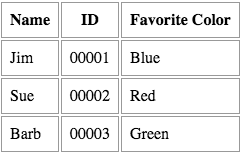

# Tables


Out in the wild there'll be times when you want to create tables on the fly. Whether it's a sizing chart for a client's products, or a data analytics report your company wants to display on its website, the truth is that Bootstrap won't always be there to save you.

So take this opportunity to study Chris Coyier's [Complete Guide to the Table Element](https://css-tricks.com/complete-guide-table-element/). You'll be glad you did.

#Summary

*via CSS-Tricks:*

Here is an example of a basic table and its corresponding code:

 

**HTML:**
```
<table>
 <thead>
   <tr>
     <th>Name</th>
     <th>ID</th>
     <th>Favorite Color</th>
   </tr>
 </thead>
 <tbody>
   <tr>
     <td>Jim</td>
     <td>00001</td>
     <td>Blue</td>
   </tr>
   <tr>
     <td>Sue</td>
     <td>00002</td>
     <td>Red</td>
   </tr>
   <tr>
     <td>Barb</td>
     <td>00003</td>
     <td>Green</td>
   </tr>
 </tbody>
</table>```
**CSS:**
```
td, th {
 border: 1px solid #999;
 padding: 0.5rem;
}```

